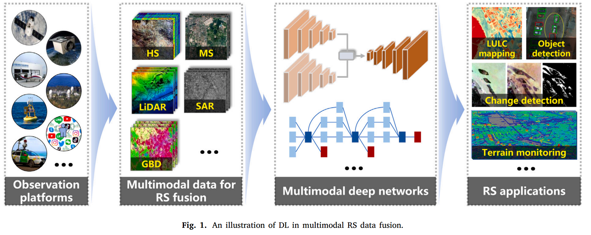
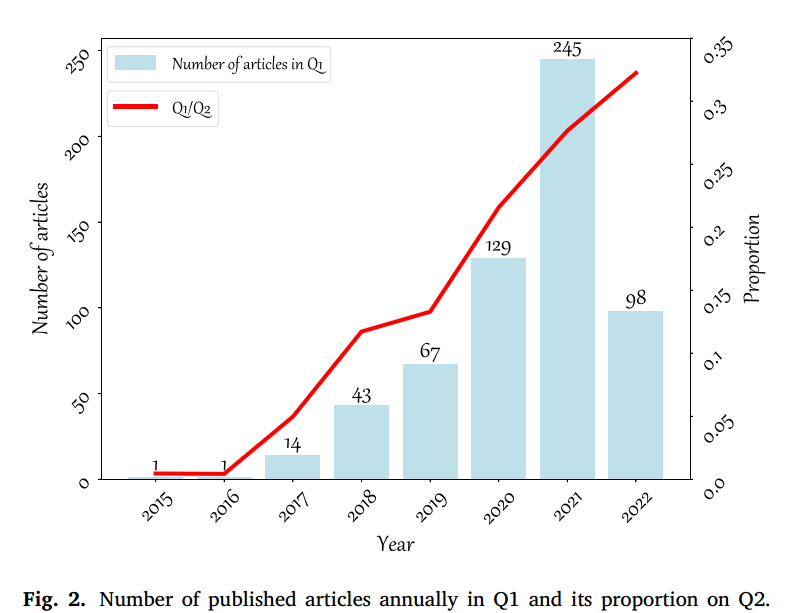

Deep learning in multimodal remote sensing data fusion: A comprehensive review

<!--more-->

## Deep learning in multimodal remote sensing data fusion: A comprehensive review

### Abstract

​		随着遥感（RS）技术的飞速发展，现在可以获得大量具有相当大和复杂的异质性的地球观测（EO）数据，这为研究人员提供了以新的方式解决当前地球科学应用的机会。近年来，随着对EO数据的联合利用，多模态遥感数据融合的研究取得了巨大进展，但这些发展起来的传统算法由于缺乏对强异构数据的综合分析和解释能力，不可避免地遇到性能瓶颈。因此，这种不可忽视的限制进一步引起了对具有强大处理能力的替代工具的强烈需求。深度学习（DL）作为一项前沿技术，凭借其令人印象深刻的数据表示和重构能力，在众多计算机视觉任务中取得了显着的突破。当然，它已成功应用于多模态遥感数据融合领域，与传统方法相比取得了很大的进步。本次调查旨在对基于深度学习的多模态遥感数据融合进行系统概述。更具体地说，首先给出有关该主题的一些基本知识。随后，进行文献调查来分析该领域的趋势。然后根据待融合的数据模态回顾了多模态遥感数据融合中的一些流行子领域，即时空谱、时空、LiDAR、合成孔径雷达和遥感地理空间大数据融合。此外，我们还收集和总结了一些有价值的资源，以促进多模态遥感数据融合的发展。最后，强调了尚未解决的挑战和潜在的未来方向

### 1. Introduction

​		由于遥感在观测地球环境方面的优越性，在各种对地观测任务中发挥着越来越重要的作用(Hong等，2021b；Zhang等，2019a)。随着多模态遥感数据的可用性不断增加，研究人员可以轻松访问适合当前应用的数据。尽管大量的多模态数据变得容易获得，但每种模态只能捕获一个或几个特定属性，因此无法完全描述观察到的场景，这对后续应用造成了很大的限制。当然，多模态遥感数据融合是摆脱单模态数据困境的可行途径。通过整合从多模态数据中提取的互补信息，在许多任务中可以做出更稳健、更可靠的决策，例如变化检测、LULC等。

​		与多源和多时相遥感不同，“模态”一词一直缺乏明确和统一的定义。在本文中，我们试图在之前的工作的基础上给出详细的定义（Gómez-Chova et al, 2015；Dalla Mura et al, 2015）。遥感数据的特征主要有两个主要因素，即传感器的技术规格和实际采集条件。具体来说，前者决定了产品的内部特性，如成像机制、分辨率等。而后者控制外部属性，例如采集时间、观察角度和安装平台。因此，上述因素产生了对捕获场景的描述，可以描述为“模态”。显然，多模态遥感数据融合包括多源遥感数据融合和多时相遥感数据融合。

​		一些典型的遥感模态包括 Pan、MS、HS、LiDAR、SAR、红外、夜光和卫星视频数据。最近，GBD作为RS家族的新成员，在EO任务中引起了越来越多的关注。为了整合这些模态提供的补充信息，传统方法通过基于特定领域知识设计手工特征并利用粗糙的融合策略进行了深入研究，这不可避免地损害了融合性能，特别是对于异构数据（Hong et al, 2021a） 。由于人工智能的发展，深度学习通过自适应地自动实现特征提取和融合，在对输入和输出数据之间的复杂关系进行建模方面显示出巨大的潜力。根据待融合的模态和相应的任务，基于深度学习的多模态遥感数据融合可以推广到一个统一的框架中（见图1）。因此，本综述将重点关注每个融合子域中提出的方法，并简要介绍每种模式和相关任务。

​		目前，已有一些关于多模态数据融合的文献综述，根据不同模态融合总结如表2。现有的综述要么较少关注深度学习的方向，要么只涵盖多模态遥感数据融合中的几个子领域，缺乏对此主题的全面系统的描述。我们调查的目的是对基于深度学习的多模态遥感数据融合中的热门领域进行全面回顾，并进一步促进这一新兴领域的相关研究。更具体地说，第 2 节收集并分析了与该主题相关的文献，随后的第 3 节详细阐述了多模态遥感数据融合中的代表性子领域。第 4 节给出了一些关于教程、数据集和代码的有用资源。最后，第 5 节提供了有关挑战和前景的评论。为方便读者阅读，本文使用的主要缩写如表1所示。

### 2. Literature analysis

#### 2.1 Data retrieval and collection

本节选择Web of Science和CiteSpace（Chen，2006）作为主要分析工具。以表 3 中的查询一为例，通过使用高级检索，最初从 Web of Science 核心合集返回 691 条结果： TS=(''遥感'') AND TS=(''深度学习'') AND TS =(''融合'').仅考虑“文章”文献类型后，纳入2015年至2022年发表的598篇论文进行后续分析。

#### 2.2 Statistical analysis and results

##### 2.2.1 Statistical analysis of articles published annually

2015-2022年相关论文发表趋势如图2所示。从柱状图可以看出，这一新兴领域越来越受到关注，论文数量稳步增长。另一方面，折线图的上升趋势与条形图一致，这表明深度学习技术在多模态遥感数据融合领域发挥着越来越重要的作用。

##### 2.2.2 Statistical analysis of the distribution of publications in terms of countries and journals
图3（a）和图3（b）分别显示了前10个国家和期刊发表论文比例的两个饼图。可以看出，前10名国家约占总产出的90%，构成该方向的主要支柱。更具体地说，中国在该领域做出了重大贡献，占所有出版物的一半以上，其次是美国，约占10%。此外，《Remote Sensing》、《IEEE TRANSACTIONS ON GEOSCIENCE AND REMOTE SENSING》和《IEEE Journal of Selected Topics in Applied Earth Observations and Remote Sensing》约占全部出版物的一半，其中《Remote Sensing》排名第一。

##### 2.2.3. Statistical analysis of the keywords in the literature

图4展示了收集到的文章中出现的关键词，其中字体越大，出现频率越高。如图所示，CNN广泛应用于基于DL的多模态RS数据融合领域。此外，分类、去云和目标检测成为融合过程中的主要任务，其中MS、HS、LiDAR和SAR是主要使用的数据。

### 3. A review of DL-based multimodal remote sensing data fusion methods
​		本文将现有方法分为两大类，即同质融合和异质融合。具体来说，同质融合是指全色锐化、HS全色锐化、HS-MS融合和时空融合，异质融合包括LiDAR光学、SAR光学和RS-GBD融合。由于上述子领域的发展较为多样化，因此对每个子领域采用不同的标准进行介绍，如图5所示。为了方便读者，我们还列出了每个方向的一些经典文献。

#### 3.1. Homogeneous fusion

​		同质融合，包括空谱融合（即全色锐化、HS全色锐化和HS-MS融合）和时空融合，主要致力于解决由于光学图像中的空间-光谱和空间-时间分辨率发生的权衡问题。成像机制。本节将介绍这些领域提出的典型方法。

##### 3.1.1 Pansharpening

​		全色锐化是指将 MS 和 Pan 融合以生成高空间分辨率的 MS 图像。一般来说，AE、CNN 和 GAN 是基于深度学习的全色锐化常用的网络架构。

- 监督方法

​		众所周知，监督方法通过将观察结果与参考图像联系起来来执行全色锐化。通常，需要通过对原始数据进行空间下采样来模拟输入数据。Huang等人（2015）提出了第一个基于DL的方法来处理全色锐化问题，其中采用稀疏去噪AE来学习Pan域中的变换，然后将MS输入到预训练的AE中以生成最终输出。在这一里程碑式的工作之后，人们陆续提出了许多将全色锐化视为图像超分辨率问题的方法（Azarang 和 Ghassemian，2017；Xing 等人，2018）。除了AE结构之外，CNN也被广泛使用，可以分为三大类，即单分支、多分支和混合网络。属于第一组的方法只是将输入 Pan 和上采样 MS 或其预处理版本连接成一个新组件作为网络的输入。例如，Masi 等人 (2016) 通过调整 SRCNN 架构提出了第一个基于 CNN 的具有三个卷积层的全色锐化方法。后来，受这一开创性工作启发，许多方法被提出，其中通常使用残差学习和密集连接（Wei等人，2017；Yang等人，2017；Scarpa等人，2018；Yuan等人，2018；Peng等人 ，2020；Fu 等人，2020；Lei 等人，2021）。然而，简单地将预插值 MS 与 Pan 叠加作为网络的输入不仅会忽略它们的独特特征，还会增加额外的计算负担。因此，多分支网络不是同等对待两种模态，而是应用不同的子网络来分别提取模态特定的特征（Shao and Cai，2018；Zhang et al，2019b；Liu et al，2020a；Chen et al， 2021；Zhang 和 Ma，2021；Xing 等人，2020；Yang 等人，2022a）。基于混合网络的方法通过结合传统方法的概念，即基于 DI 的方法（He et al, 2019a；Deng et al, 2020）和基于 VO 的方法（Shen et al, 2020），为全色锐化提供了尖端的解决方案。 2019；Cao 等人，2021；Tian 等人，2021），因此有效地融合了两个领域的优势。与 CNN 不同，基于 GAN 的方法通过在生成器网络和判别器网络之间建立对抗性博弈，将全色锐化视为图像生成问题。第一个基于 GAN 的全色锐化方法设计了一个两分支生成器网络（Liu et al, 2020b），然后探索不同的损失函数和新的网络结构以提取更多判别性特征（Shao et al, 2019；Ozcelik et al, 2020） ；Gastineau 等人，2022）。 ViT 最近因其捕获远程信息的能力而被引入全色锐化（Zhou et al, 2021a, 2022a）

- 无监督方法

​		监督方法中可能会出现与尺度相关的问题，因为它们通常以较低的分辨率进行训练。然而，无监督方法以原始规模实现训练和测试过程，而不需要模拟参考图像。因此，关键在于通过设计适当的损失函数来精确建立输入数据和融合产物之间的关系，即退化的融合结果应分别在空间域和谱域中与输入Pan和MS相同。例如，Ma 等人（2020）利用空间对抗性损失来表示隐藏在生成器输出中的空间信息。此外，其他广泛使用的损失函数包括梯度损失（Seo et al, 2020）、感知损失（Zhou et al, 2020）和非参考损失（Zhou et al, 2021b；Luo et al, 2020）

#### 3.1.2. HS pansharpening

​		与全色锐化类似，HS 全色锐化旨在将 HS 中的光谱信息与 Pan 中的空间信息相结合，以生成具有高空间分辨率的 HS 图像。

- 监督方法

​	监督方法旨在学习现实世界中不存在的输入到目标数据的转换，因此通常会进行模拟实验。具体来说，一对低空间分辨率HS和低光谱分辨率MS是通过分别在空间和光谱上降低观测到的HS而生成的。通过这样做，两个模拟图像被视为网络的输入，原始HS作为参考。

​		与全色锐化的先驱工作一样，CNN 和 GAN 自然适用于 HS 全色锐化任务。 Cheng 等人 (2020) 提出了一种基于 CNN 的单分支方法，其中多个通道空间注意力块级联以自适应地提取信息特征。受代表性工作的启发，通过添加空间相关约束来优化 HS 上采样过程，进一步增强了 DHP（Bandara 等人，2022）。为了恢复隐藏在输入中的丢失信息，残差式网络被广泛应用于两分支 HS 全色锐化网络中。特别是，He et al (2019b) 清楚地展示了跳跃连接在训练效率方面的优越性。人们还付出了巨大的努力来解决特定问题，例如光谱保真度（He et al, 2020；Guan and Lam, 2021）、任意分辨率增强的全色锐化（He et al, 2021b）和任意光谱带（Qu等人，2022a）。混合网络，例如 DI 嵌入方法（Dong et al, 2021c）和 VO 嵌入方法（Xie et al, 2020），可以自适应地学习传统方法需要显式建模的空间细节和深层先验。此外，Dong 等人 (2021d) 直接将迭代优化算法展开到端到端网络中，其中退化模型被认为是利用先验信息。遵循全色锐化中提出的想法，GAN 通过各种判别器设计成功应用于 HS 全色锐化。 Xie 等人（2021）给出的一个典型示例利用空间鉴别器来限制输入 Pan 和生成输出的频谱下采样版本之间的差异，其中生成器网络在高频下进行训练。其他常用的判别器包括光谱鉴别器（Dong et al, 2021b）和空间光谱鉴别器（Dong et al, 2021a）。 Transformer 还在 Bandara 和 Patel (2022) 的 HS 全色锐化中得到了应用，其中特定模态的特征提取器旨在捕获纹理细节以用于后续的光谱细节融合。

- 无监督方法

​		与全色锐化相比，无监督 HS 全色锐化很少被研究。一个可能的原因是输入Pan和MS具有相似的光谱覆盖范围，而Pan和HS在光谱范围上存在较大差异，这导致空间信息保存困难。 Nie 等人（2022）的一项尝试性工作利用梯度和高频损失来建模空间关系，其中首先通过比率估计策略生成初始化图像。

#### 3.1.3 HS-MS fusion

​		全色锐化相关工作可以被视为 HS-MS 融合的特例，其目的是通过融合成对的 HS-MS 图像来获得具有高空间分辨率的 HS 产品。因此，许多基于深度学习的全色锐化方法可以通过必要的修改来解决 HS-MS 融合问题。接下来，将按照全色锐化中的相同分类法介绍典型方法。

- 监督方法

​		有监督的 HS-MS 融合遵循与 HS 全色锐化相同的方案，即用 MS 替换输入 Pan。提出了具有经典结构的单分支HS-MS融合方法，例如3-D CNN（Palsson等人，2017）、残差网络（Han和Chen，2019）、密集连接网络（Han等人，2018）、和三分量网络（Zhang et al, 2021a）等。与这些直接将 HS 上采样到与 MS 相同分辨率的单分支工作相比，多分支方法采用了一种替代策略来缓解这个问题，即通过逐步上采样 HS通过反卷积或像素洗牌操作，将从MS中提取的空间信息注入到相应的尺度中（Xu等人，2020a；Han等人，2019；Zhou等人，2019）。最近，可解释网络与传统模型相结合，在这项任务上显示出了巨大的潜力，例如将 DI 模型合并到网络中以自适应地学习详细图像（Sun 等人，2021 年；Lu 等人，2021 年），或设计网络来自动学习观察结果模型（Wang 等人，2021b，2019）和深度先验（Dian 等人，2018；Wang 等人，2021a）为后续融合做准备。 HS-MS 融合中也采用了深度展开方法，通过将迭代优化过程展开为网络训练步骤，有效地链接了基于 DL 和 VO 的方法（Shen 等人，2022；Xie 等人，2022，2019；Wei 等人） ，2020；Yang 等人，2022b)。除了流行的 CNN 模型之外，Xiao 等人（2021）通过将退化模型嵌入到生成器中，引入了一种基于物理的 GAN 方法，其中退化模型生成的输出被输入到鉴别器中以进一步进行空间频谱增强。 Transformer 也被引入用于 HSMS 融合（Hu et al, 2021a），其中结构化嵌入矩阵被发送到 Transformer 编码器中以学习残差图

- 无监督方法

​		无监督HS-MS融合方法只需要一对HS-MS图像作为网络的输入，当网络优化完成后就可以获得融合的HS。这些方法大致包括两类，即基于编码解码的方法和基于生成约束的方法。前一类假设目标图像可以通过两个矩阵相乘来表示，每个矩阵代表一个明确的物理意义，其中AE通常用于对上述过程进行建模。第一项工作是由 Qu 等人 (2018) 提出的，其中解码器的权重由两个 AE 共享。沿着这个思路，最近提出了几种具有类似想法的成功方法（Zheng et al, 2021; Yao et al, 2020; Liu et al, 2022b）。后者旨在通过精心设计的生成器，以初始化图像作为输入，直接生成目标图像。为了获得更好的重建，需要额外的信息和约束来指导网络训练。更具体地说，输入图像可以是手头的 MS 图像 (Fu et al, 2019; Han et al, 2019a; Li et al, 2022)、随机张量 (Uezato et al, 2020; Liu et al, 2021b) ），以及专门学习的代码（Zhang et al, 2021b, 2020b）。

#### 3.1.4. Spatiotemporal fusion

​		除了空间-光谱分辨率的权衡之外，时空域也存在矛盾，即现有卫星平台捕获的同一区域的高空间分辨率图像通常需要较长的时间间隔。反之亦然，这极大地阻碍了变化检测等实际应用。因此，时空融合旨在通过在预测时间融合一对或多对粗/精细图像（例如 MODIS-Landsat 对）和粗空间分辨率图像来产生具有精细空间分辨率和精细时间分辨率的产品。本节介绍一些典型的地表变量预测方法，例如反射率、LST、NDVI等

​		大多数基于深度学习的方法都是针对反射图像而设计的，其中 CNN 在所有模型中占主导地位。受超分辨率问题的启发，Song 等人（2018）提出了这项开创性的工作，其中学习非线性映射和超分辨率网络来生成预测图像。然而，由于缺乏对时间信息的探索，简单地将时空融合视为超分辨率问题不可避免地会损害性能，因此提出了许多同时利用时空域基础信息的方法（Tan et al, 2018, 2019 ；Li 等人，2020a)。特别是，Liu等人（2019）通过将时间信息合并到损失函数中，在训练过程中利用了时间依赖性和时间一致性，从而获得了显着的改进。与 CNN 相比，有一些基于 GAN 的方法旨在通过优化最小-最大问题来生成输出。张等人（2021c）提出了一种基于深度学习的端到端可训练网络来解决时空融合问题，其中设计了一个两阶段框架来逐步恢复预测图像。然而，所有讨论的方法都需要至少三个图像作为预测阶段的输入，这在实践中可能不容易满足。因此，Tan 等人 (2022) 提出了一种嵌入归一化技术的基于条件 GAN 的方法，以消除对输入图像数量的限制。

​		与上述模型相比，最初为LST或NDVI设计的基于深度学习的方法相对较少。尽管一些文献采用面向反射率的方法来生成其他地表变量的乘积并取得了良好的性能，但这些变量之间仍然存在差异。面对这个问题，Yin 等人（2021b）通过考虑时间一致性，提出了一种面向 LST 的方法，其中多尺度 CNN 生成的两个最终输出根据一种新颖的权重函数融合在一起。对于 NDVI 产品，Jia 等人（2022）提出了一种具有超分辨率网络和融合网络的多任务框架，其中引入时间约束损失函数来减轻时间一致性假设。

### 3.2 Heterogeneous fusion

​		与旨在基于像素级融合生成高光谱、空间或时间分辨率的结果的同质融合不同，异质融合主要指LiDAR光学、SAR光学、RS-GBD等的集成。这些数据的成像机制完全不同，广泛采用特征级和决策级。

#### 3.2.1 LiDAR-optical fusion

​		激光雷达-光学融合可以应用于许多任务，例如配准、全色锐化、目标提取、森林生物量估计（Zhang and Lin，2017）。由于很难对所有方面进行全面详细的介绍，因此我们重点关注一个特定领域，即 HS-LiDAR 数据融合在 LULC 分类中的应用，并给出一些在其他任务中使用的示例

​		HS数据凭借其丰富的光谱信息被广泛应用于分类任务，但在光谱信息不足以区分目标的情况下，其性能不可避免地遇到瓶颈（Hong et al, 2020a）。幸运的是，LiDAR系统能够获取3D空间几何形状，这弥补了HS的不足，因此HS和LiDAR数据的联合利用成为近年来的热点。 Ghamisi 等人 (2017) 开创了第一个基于 DL 的 HS-LiDAR 融合网络，其中输入数据的特征由 EP 提取，然后通过两种融合策略进行集成，并输入到随后的基于 DL 的分类器。虽然与传统方法相比取得了很大的进步，但特征提取和特征融合的方式简单、粗糙，在一定程度上限制了进一步的改进。受这一里程碑的启发，人们提出了许多先进的方法，旨在改进这两个关键步骤。对于特征提取，Chen等人（2017）给出了一个典型的例子，他们利用两分支网络分别提取光谱-空间-高程特征，然后使用全连接层来整合这些异构特征以进行最终分类。其他专门设计的特征提取网络包括三分支网络（Li et al, 2018）、双通道网络（Xu et al, 2018；Zhao et al, 2020）和编码器-解码器翻译网络（Zhang et al, 2020） ，2020a）。对于特征融合，Feng 等人（2019）将SENet纳入融合步骤，以自适应地实现特征校准。还提出了其他新颖的融合策略，例如交叉注意模块（Mohla 等人，2020）、基于重建的网络（Hong 等人，2022）、特征决策组合融合网络（Hang 等人，2020）、和图融合网络（Du et al, 2021）。 Hang 等人（2022）没有直接利用 HS-LiDAR 数据进行分类，而是提出了一种新策略来解决 HS 分类中训练样本有限的问题。具体来说，首先利用配对的 HS-LiDAR 数据来提取有用的特征，然后设计微调策略以将这些特征转移到有限样本的 HS 分类中。

​		激光雷达-光学融合的研究人员也关注目标提取，例如建筑物、道路、不透水表面等。Huang等人（2019）提出了一种嵌入门控特征标记单元的编码器-解码器网络来识别建筑物和非建筑物。建筑物区域。 Parajuli 等人 (2018) 和 Sun 等人 (2019) 还分别提出了提取道路和不透水表面的算法。最近，Han 等人 (2022) 提出了第一个基于 DL 的多模态分解网络，其中通过挤压和激励注意模块提取的 LiDAR 高度信息用于指导 HS 中的分解过程。

#### 3.2.2. SAR-optical fusion

​		与光学图像不同，SAR系统旨在采集地物后向散射信号，这些信号不仅能反映雷达系统参数信息，还能体现观测场景的物理和几何特征(Liu et al, 2021a)。尽管SAR数据可以为光学图像提供补充知识，但它很容易产生散斑噪声，这可能会严重限制其实际潜力。 SAR和光学数据的联合使用成为实现更好地理解和分析感兴趣目标的可行解决方案。

​		根据融合的级别，我们可以将SAR-光学数据融合分为像素级、特征级和决策级三类。尽管SAR与光学数据在成像机制上存在较大差距，但借助 SAR 图像，通过像素级融合生成纹理和结构信息丰富的光学产品是可行的。在这种情况下，配准变得极其重要，并且提出了许多基于深度学习的SAR和光学数据配准方法，例如孪生CNN（Zhang等人，2019c）和自学习和可转移网络（Wang等人，2018）。在获得一对共同配准的SAR光学数据后，许多最初为全色锐化设计的传统方法被扩展到SAR光学像素级融合。 Kong等人（2021）提出了一种基于GAN的网络，包含U形生成器和卷积鉴别器，其中考虑了广泛的损失，以完全消除散斑噪声并保留丰富的结构信息。此外，光学图像很容易受到大气条件的影响，其中云层严重损害了光谱和空间信息。幸运的是，由于 SAR 不受天气条件的影响，因此对这些因素几乎不敏感。因此，许多基于像素级的方法被设计为借助同一区域的辅助SAR数据从相应的云破坏光学图像生成无云光学图像（Gao等人，2020年；Grohnfeldt等人，2018年） 。其中，Meraner等人（2020）采用简单的残差结构直接学习从输入数据对到无云目标的映射，即使在场景被厚云覆盖的情况下也证明了其优越性。最近，李等人(2022b)提出了第一个SAR-光学时空融合方法，在transformer的帮助下恢复多云地区植被NDVI。

​		除了像素级融合之外，使用 SAR 光学数据进行 LULC 分类等应用的高级融合也引起了相当大的兴趣。 Hu 等人 (2017) 提出了第一个基于深度学习的 HS-SAR 数据融合网络，其中使用简单而有效的两分支架构来单独提取异构特征以进行最终的卷积融合。然而，在不考虑信息冗余的情况下，这种直接特征提取的效率仍然有限。因此，设计了一种受稀疏约束约束的新型 BN 技术，以减少不必要的特征并使网络具有更好的泛化能力（Li et al, 2022a）。同时，Wang等人（2022b）提出了一种交叉注意辅助模块来实现特征融合，同时捕获输入数据的远程依赖性。除了上述任务外，SAR-光融合还应用于变化检测（Li et al, 2021）、生物量估计（Shao et al, 2017）等。

#### 3.2.3. RS-GBD fusion

​		GBD包含来自社交媒体、地理信息系统、手机等的广泛来源，这极大地有助于我们对生活环境的理解。更具体地说，RS表现出从全球视角捕捉大尺度地球表面物理属性的强大能力。另一方面，GBD提供的信息与人类行为高度相关，给出了丰富的社会经济描述，作为RS的补充。值得注意的是，GBD和RS在数据结构上存在很大差距，因此当前广泛用于提取模态特定特征的流行双分支网络不能直接用于GBD和RS数据的融合。本节根据融合过程中使用的GBD类别，整理了RS-GBD融合中的一些成功示例，例如街景图像、POI、车辆轨迹数据等

​		POI是指可以抽象为点的物体，例如剧院、公交车站、房屋等。与RS数据不同，每个POI通常包含名称、坐标和其他一些地理信息，这些信息可以通过电子地图（例如OpenStreetMap）轻松收集。由于每个POI的属性与功能设施密切相关，POI与RS的集成为城市功能区划分任务提供了新的机遇。最近，Lu 等人 (2022) 提出了一种基于 DL 的统一方法来联合利用 POI 和 RS 的特征。具体来说，首先将POI转换为距离热图以满足CNN的输入要求，然后使用两个模块分别进行特征提取和空间关系探索。还提出了其他具有不同结构的相关算法，例如深度多尺度网络（Xu等人，2020b；Bao等人，2020）和双分支网络（Fan等人，2021）。除了上述城市功能区划分任务外，人口测绘也得到了 POI 的巨大帮助。例如，Cheng等人（2021）首先将包括POI、道路网络和RS图像在内的多模态数据转换为高维张量表示作为网络的输入，然后采用双流模型来提取空间和用于人口估计的属性特征。

​		除了 POI 之外，街景图像是另一个重要的数据源，可以从社交媒体（例如 Twitter、Instagram 和微博）和街景汽车（例如 Google、百度和高德）收集。与遥感数据不同，它从人类的角度提供了沿街道网络的细粒度图像，因此提供了关于我们周围环境的多样化和互补的描述（Lefèvre et al, 2017）。Srivastava 等人（2019）给出了一个典型的例子，他们利用 RS 和 Google 街景数据实现城市土地利用分类。更具体地说，使用双分支结构网络分别从两种模态中提取特征，然后将其堆叠成新特征以供后续分类。值得一提的是，作者提出了一种新颖的解决方案来处理测试阶段丢失一种模态数据的棘手情况。由于监督分类器的样本标记始终是一项昂贵且耗时的任务，Chi等人（2017）提出了一种借助社交媒体照片和深度学习的新颖系统来降低标记成本，成功实现了RS图像分类

​		此外，其他类型的GBD在融合任务中也受到了极大的关注。利用出租车轨迹、时间序列用电、用户访问数据等各种与市民相关的数据来识别城市功能区（Qian等，2020；Cao等，2020；Yao等，2022）。此外，Liu等人（2022c）设计了两个AE来分别从轨迹和RS数据中提取模态特定和跨模态表示，在道路提取方面实现了显着的性能改进。 Mantsis 等人 (2022) 使用与雪相关的推特以及 Sentinel-1 图像来实现雪深估计。 He等人(2021a)采用二分支网络从RS和腾讯用户密度中提取信息来估计混合土地利用的比例。

### 4. List of resources

​		凭借大量的多模态遥感数据，基于深度学习的技术在数据融合方面取得了重大突破。众多利用各种多模态数据的深度学习模型和相关算法不断涌现，这为从事基于深度学习的多模态遥感数据融合研究的人们提供了无尽的启发。为了该领域的发展和交流，我们收集和总结了一些相关资源，包括初学者教程、文献中使用的可用多模态遥感数据以及作者提供的开源代码。

#### 4.1. Tutorials

​		我们进一步为愿意从事深度学习相关 RS 任务的初学者提供了一些材料和参考资料，如表 4 所示。RS 类别中的参考资料可以让读者快速全面地了解 RS 的特征、原理和应用。与RS不同的方式。深度学习中的材料介绍了一些广泛使用的模型，这些模型构成了几乎所有基于深度学习的算法的支柱。接下来，我们推荐了RS & AI领域的五篇经典参考文献，旨在展示DL在RS中的一些成功应用。通过上述教程及其引文，读者可以了解相关背景的基本知识，为进一步的研究做好准备。

#### 4.2. Available multimodal RS data

​		为了综合评估现有算法并选择适合实际应用的模型，可用的多模态遥感数据集是整个融合过程中不可或缺的环节。 IEEE地球科学与遥感学会数据融合技术委员会（DFTC）自2006年起每年举办一次数据融合竞赛，为研究人员提供了宝贵的多模态遥感数据集，促进了数据融合领域的发展。如今，这些可用的数据集已在文献中广泛用于方法学评估。更多信息可以在 Dalla Mura 等人 (2015) 以及 Kahraman 和 Bacher (2021) 中找到，它们提供了这些数据集及其应用的详细摘要。因此，在本节中，我们收集表 5 中的可用数据集，除了 DFTC 提供的上述数据集，为 RS 社区做出贡献。

#### 4.3. Open-source codes in DL-based multimodal RS data fusion

​		对于已经具备该领域一些背景知识并准备设计自己的算法的研究人员来说，开源代码可以为他们提供巨大的帮助。在这种情况下，我们在表 6 中搜索并总结了来自 GitHub 和作者主页的可用代码，以便对不同方法进行比较。

### 5. Problems and prospects

​		最近，基于深度学习的多模态遥感数据融合取得了很大进展。但仍存在一些问题有待解决。本节旨在指出快速增长领域当前面临的挑战，并对未来方向进行展望。

#### 5.1. From well-registered to non-registered

​		图像配准是许多 RS 任务的基本先决条件，例如数据融合和变化检测。由于两种模态之间的配准精度对图像融合具有不可忽视的影响，因此高精度对齐待融合数据成为融合过程之前极其重要的步骤，特别是对于像素级融合。由于有多个平台同时配备Pan和MS传感器，在相同的大气环境和相同的采集时间下很容易获得配对的Pan-MS图像，这大大降低了配准难度。相反，在相同情况下获得配对的 HS-Pan 或 HS-MS 图像相当困难，因此与 Pan-MS 相比，数据配准成为一项关键任务。然而，人们对先进融合算法的设计给予了很多关注，假设输入数据是完美配准的，从而忽略了这种预处理的重要性。只有少数基于深度学习的融合工作着眼于多任务，共同实现图像配准和融合。最近，Zheng 等人（2022）尝试在端到端无监督融合网络中实现配准和融合任务，其中输入是一对未配准的 HS-MS 数据。将来，建议更多地关注配准步骤，并将此预处理纳入融合过程中。

#### 5.2. From image-oriented to application-oriented quality assessment

​		对输出产品的质量评估是整个融合过程中不可或缺的一部分。高层次融合（即特征级和决策级）的评估通常取决于后续应用的性能，例如分类、目标检测和变化检测。然而，像素级融合的评估通常是通过计算空间域和光谱域的相关指标来实现的，可分为有参考质量和无参考质量两类。对于第一类，在融合产品和参考图像之间计算一些广泛使用的指标，例如SSIM、SAM和ERGAS。然而，现有的指标不足以全面、公平地展示和比较各种方法，这不可避免地阻碍了用户选择适合实际应用的方法。最近，Zhu等人（2022）提出了一种用于时空产品质量评估的新框架，该框架不仅考虑了空间和光谱误差，还考虑了输入数据和地表的特征。另一方面，在实践中参考图像很可能不容易获得，因此迫切需要设计一种不需要参考的索引。 Liu et al (2015)提出了一种使用更符合人类视觉系统的高斯尺度空间进行全色锐化的非参考索引。此外，一些研究者采用面向应用的评价指标来判断全色锐化方法的性能，例如Qu等人(2017) 通过比较全色锐化输出中的异常检测性能来评估全色锐化方法。一般来说，更希望采用与应用相关的指标来评估不同的算法，因为融合的目的是结合互补信息以在特定应用中做出更好的决策。因此，基于深度学习的融合方法将与应用相关的指标纳入其损失函数中，以指导网络学习更适合后续应用的代表性输出是一个好方法。

#### 5.3. From two-modality to multi-modality

随着机载和星载平台上多种传感器的快速发展，可用模式变得更加多样化。目前，大多数基于深度学习的融合算法仅针对两种模态设计，限制了多模态的应用能力。

因此，如何有效地利用更多的模态数据并充分发挥其潜力并进一步消除性能瓶颈是多模态数据融合任务中仍然存在的挑战。更重要的是，随着越来越多的模态数据易于访问，未来的研究可以考虑开发一个基于深度学习的统一框架，该框架可以处理任意数量的模态作为输入。

#### 5.4. From multimodal to crossmodal learning

尽管具有不同特征的多模态数据有助于我们对世界的理解，但在实际场景中更有可能缺少某些模态数据。例如，SAR 和 MS 数据在全球范围内可用。相比之下，由于传感器的限制，HS数据的收集更加困难，这可能会导致某些地区的数据短缺。因此，如何将隐藏在多模态数据区域中的信息转移到缺少一种模态的场景中是跨模态学习要解决的一个典型问题。

Hong 等人 (2020b) 提出了一种基于深度学习的代表性方法来解决这个实际问题，其中在训练阶段使用有限数量的 HS-MS 或 HS-SAR 对来实现仅由一种模态数据覆盖的某个区域的大规模分类任务。未来，相信在RS大数据和深度学习的影响下，这一关键领域将在RS融合界受到更多关注。

#### 5.5. From single-platform to cross-platform

目前的观测平台已经扩展到地面、机载和星载领域，为用户提供了无尽的跨平台数据。特别是，无人机因其高机动性而在 RS 界引起了越来越多的关注，在许多任务中显示出巨大的潜力（Wu 等人，2021b）。

虽然跨平台的图像使我们能够从新的角度观察地球环境，但这些数据不仅在空间尺度上表现出截然不同的特征，而且在获取时间上也存在差异，这成为了不可忽视的障碍。融合程序。因此，如何突破不同平台之间存在的壁垒，实现有效的信息交互是未来需要研究的方向。

#### 5.6. From black-box to interpretable DL

尽管深度学习近年来取得了许多突破，但它经常被指责为难以解释的黑盒学习过程。

与具有明确物理和数学含义的传统方法不同，基于深度学习的方法提取难以解释的高级特征。正如第 3.1.1 节中所讨论的，许多基于模型驱动的深度学习的方法被相继提出来设计一个完全可解释的网络，每个模块呈现一个特定的操作。

模型驱动和数据驱动方法的结合为理解黑盒网络中的工作流程提供了新的视角，也指出了使黑盒透明的解决方案。

然而，该解决方案仅限于空谱融合领域，难以应用于特征级和决策级融合。因此，高层融合仍然停留在研究人员非常关注特征提取和特征融合的阶段，而不是充分理解网络真正学习的内容。然而，理解每个隐藏层学到的特征有助于设计更有效的网络结构来挖掘判别特征，从而提高高级任务的性能。

### 6. Conclusion

不断增长的多模态遥感数据不仅对地球观测任务提出了挑战，同时也带来了机遇。近年来，二者优势互补，取得了重大突破。特别是，人工智能相关技术因其在特征提取方面的优越性而显示出相对于传统方法的优势。

在上述遥感大数据和尖端工具的推动下，基于深度学习的多模态遥感数据融合成为遥感社区的一个重要课题。因此，本文对这一快速发展的领域进行了全面的介绍，包括文献分析、对遥感融合几个流行子领域的系统总结、可用资源清单以及未来发展的展望。

具体来说，我们重点关注第二部分，即不同融合子领域中基于深度学习的方法，并在所使用的模型、任务和数据类型方面进行详细研究。最后，我们欣喜地发现深度学习近年来已被应用到多模态遥感数据融合的各个角落，并取得了巨大且有前景的成果，这为研究人员在未来进行深入研究提供了更多信心。
