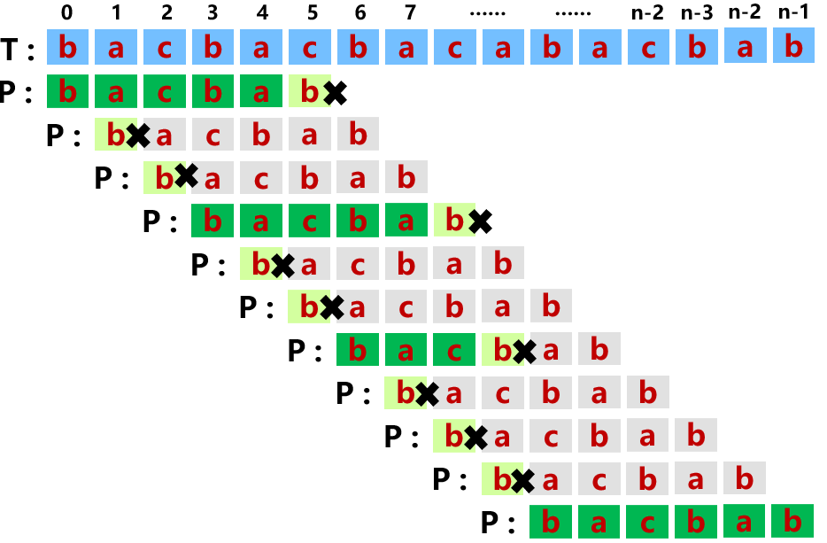

KMP算法简要介绍
<!-- more -->


KMP算法可以高效地在一个文本串T（长度为n）中查找模式串P（长度为m）的出现位置。

首先看一下蛮力匹配的匹配过程。



蛮力匹配中，如果P在位置j和T在位置i失配，P会回退到位置0，T的位置＋1，然后二者重新开始比对。这种算法的平均复杂度是O(m*n)。

可以看到，实际上P[5]和T[5]失配后，实际上可以直接从P[2]和T[5]开始比对，这是因为第一次比对的过程中，我们得到了P[0:4]==T[0:4]的信息，因此第二次比对实际上是P[0:3]和P[1:4]之间的比对，第三次比对是P[0:2]和P[2:4]之间的比对，如果我们可以预处理P字符串，得到P[0:3]!=P[1:4]，P[0:2]!=P[2:4]，P[0:1]==P[3:4]的信息，我们就可以跳过第二次和第三次比对，直接从P[2]和T[5]比对开始。如此以来我们不需要回退T的指针，可以将复杂度压缩到O(n)。

那么我们怎么从P[5]和T[5]失配得到下一次应该比对的是P[2]和T[5]呢，实际上，我们只需要找到P[0:4]的最大长度的相匹配的真前缀和真后缀即可。即如果P在位置j失配，下次比对的位置应该为
$$
next[j]=max(\{0\leq t<j|P[0,t)==P[j-t,j)\})
$$
以bacbab为例

- j=0，next[0] = -1（假想P[-1]为通配）
- j=1, b没有真前缀和真后缀，因此next[1]=0
- j=2, ba的真前缀为{b}，真后缀为{a}，没有共有元素，因此next[2]=0
- j=3，bac的真前缀为{b,ba}，真后缀为{ac,c}，没有共有元素，因此next[3]=0
- j=4,  bacb的真前缀为{b,ba,bac}，真后缀为{acb,cb,b}，二者最大长度的共有元素为b，长度为1，因此next[4]=1
- j=5，bacba的真前缀为{b,ba,bac,bacb}，真后缀为{acba,cba,ba,a}，二者最大长度的共有元素为ba,因此next[5]=2

下面用代码计算next表

```cpp
vector<int> buildNext (string& P) {
    int m = P.size();
    int j = 0;
    int t = -1;
    vector<int> next(m, -1);
    while(j < m - 1){
        if(t == -1 || P[j] == P[t]){ // 一直匹配的情况
            ++j;
            ++t;
            next[j] = t;
        }
        else{   // 失配的情况
            t = next[t];
        }
    }
    return next;
}
```

应用next表进行字符串的匹配

```cpp
int find(string P, string T){
    int m = P.size(), n = T.size();
    vector<int> next = buildNext(P);
    int i = 0, j = 0;
    while(i < n){
        if(j == -1||T[i] == P[j]){
            ++i;
            ++j;
            if(j == m){
                return i - m;
            }
        }
        else{
            j = next[j];
        }
    }
    return -1;
}
```

时间复杂度：设$$ k=2i-j $$，每次while循环如果满足$j == -1||T[i] == P[j]$则k严格增加1，如果不满足由于$j=next[j]$，即j至少会增加1，则k至少会减小1。所以while循环不会超过k次。由于$k\leq2*i_{max}-j_{min}$，所以$k\leq2*n+1$，所以时间复杂度为O(2*n+1)，即O(n)

引申一下，其实next表计算的是字符串P的**真前缀**的所有真前缀和真后缀中相同子串的最大长度，也就是没有计算P自身的所有真前缀和真后缀中相同子串的最大长度，如果是想计算后者，一种方法是在P后追加一个字符，计算这个新的字符串的next表，取next[1:end]即可；另一种方法是修改计算next的逻辑，代码如下：

```cpp
vector<int> getMaxPreSuf (string& P) {
    int m = P.size();
    int j = 1;
    int t = 0;
    vector<int> len(m, 0);
    while(j <= m - 1){
        if(P[j] == P[t]){
            t++;
            len[j] = t;
            j++;
        }
        else if (t != 0){
            t = len[t - 1];
        } else{
            j++;
        }
    }
    return len;
}
```

再引申一下，如何计算字符串P的所有前缀和字符串Q的所有后缀中相同子串的最长长度，实际上修改一下上面的getMaxPreSuf函数就行了。

```cpp
int getMax (string P, string Q) {
    int m = P.size(), n = Q.size();
    int start = m > n? 0:n - m;
    int j = start + 1;
    int t = 0;
    vector<int> len(min(m, n), 0);
    while(j < n){
        if(Q[j] == P[t]){
            t++;
            len[j - start] = t;
            j++;
        }
        else if (t != 0){
            t = len[t - 1];
        } else{
            j++;
        }
    }
    return len.back();
}
```

