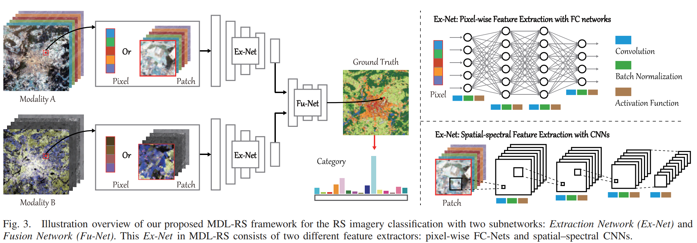
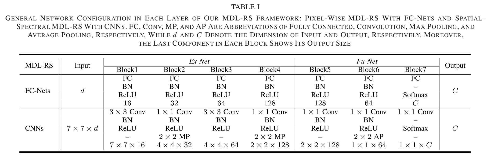
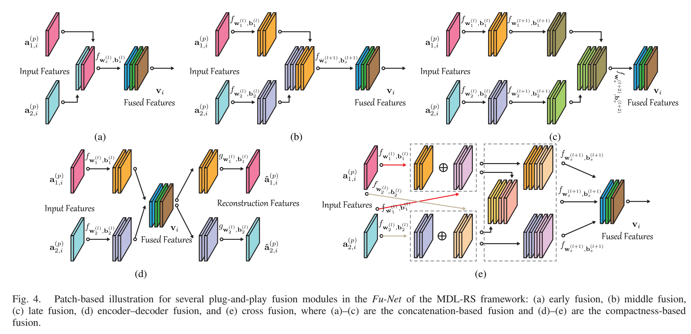
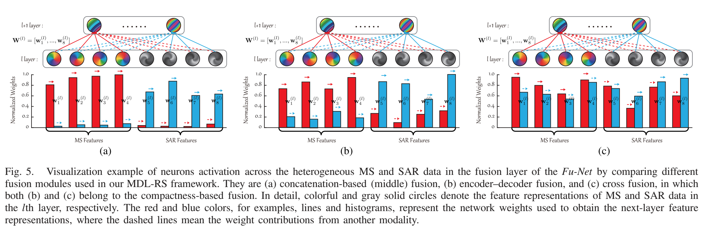

一篇遥感多模态的论文笔记

<!--more-->

源码：https://github.com/danfenghong/IEEE_TGRS_MDL-RS

本文贡献：

1. 提出了一个统一的针对遥感图像分类的多模态深度学习网络MDL-RS。

2. 提出的MDL-RS适用于MML(多模态学习)和CML(交叉模态学习，和MML在训练阶段相同，推理阶段输入的模态相比于训练阶段有缺失)两种情况。
3. 提出了5种针对不同模态数据的融合方法。

#### MDL-RS网络架构

这个网络包含两种形式，一种是pixel-wise结构的FC-Nets，另外一种是spatial-spectral结构的CNNs。FC-Nets和CNNs都包含两个阶段的网络，分别是Ex-Net(feature extraction)和Fu-Net(feature fusion)。

网络的具体架构如下：

整体来说网络结构比较简单，比较值得看的是特征融合方法。

#### 特征融合方法

本文提出了5种用于特征融合的方法，可以分为两类：Concatenation-Based Fusion和Compactness-Based Fusion。

Concatenation-Based Fusion顾名思义，就是把得到的两个模态的特征图拼接起来，根据融合位置的不同，可以分为早期融合、中期融合和后期融合。早期融合将两个模态的数据在输入到神经网络之前进行融合（从源码来看其实就是一个单流网络）。中期和后期融合是在网络的中期和后期进行融合，是双流网络的架构。

Compactness-Based Fusion分为两种，分别是编码器-解码器融合和交叉融合。前者的通过最小化重构误差，最后将编码器的输出作为融合图像。后者公式：

$$
\begin{aligned} \mathbf{a}_{1, i}^{(l)} & =f_{\mathbf{W}_1^{(l)}, \mathbf{b}_1^{(l)}}\left(\mathbf{a}_{1, i}^{(p)}\right)+f_{\mathbf{W}_1^{(l)}, \mathbf{b}_1^{(l)}}\left(\mathbf{a}_{2, i}^{(p)}\right), \\ \mathbf{a}_{2, i}^{(l)} & =f_{\mathbf{W}_2^{(l)}, \mathbf{b}_2^{(l)}}\left(\mathbf{a}_{2, i}^{(p)}\right)+f_{\mathbf{W}_2^{(l)}, \mathbf{b}_2^{(l)}}\left(\mathbf{a}_{1, i}^{(p)}\right), \\ \mathbf{v}_i & =\left[\begin{array}{cc}f_{\mathbf{W}_0^{(l+1)}, \mathbf{b}_0^{(l+1)}}\left(\mathbf{a}_{1, i}^{(l)}\right), & f_{\mathbf{W}_0^{(l+1)}, \mathbf{b}_0^{(l+1)}}\left(\mathbf{a}_{2, i}^{(l)}\right) \\ f_{\mathbf{W}_1^{(l)}, \mathbf{b}_1^{(l)}}^{(l)}\left(\mathbf{a}_{1, i}^{(p)}\right), & f_{\mathbf{W}_2^{(l)}, \mathbf{b}_2^{(l)}}\left(\mathbf{a}_{1, i}^{(p)}\right) \\ f_{\mathbf{W}_1^{(l)}, \mathbf{b}_1^{(i)}}^{\left(a_2\right.}\left(\mathbf{a}_{2, i}^{(p)}\right), & f_{\mathbf{W}_2^{(l)}, \mathbf{b}_2^{(l)}}^{(l)}\left(\mathbf{a}_{2, i}^{(p)}\right)\end{array}\right]\end{aligned}
$$
针对这五种融合策略，作者做了实验发现，Concatenation-Based Fusion的方法，跨模态的神经元很少被激活，也就是说两个模态虽然被拼接到一块了，但其实并没有有效融合。Compactness-Based Fusion可以缓解这种问题，尤其是交叉融合的效果最显著。

最后的实验结果上，融合方法最好的是交叉融合，尤其是在CML的实验中，交叉融合的优势更加显著。