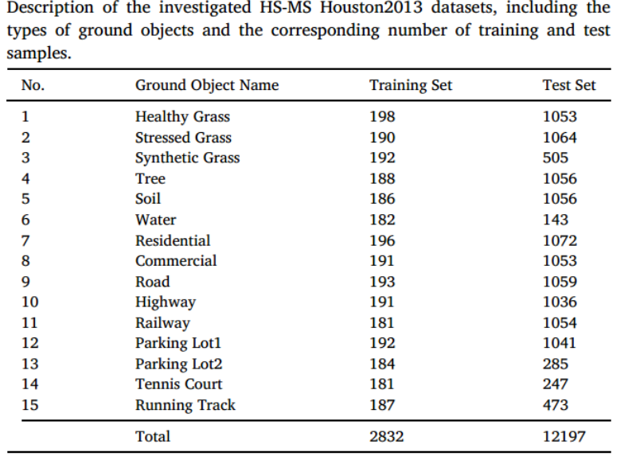
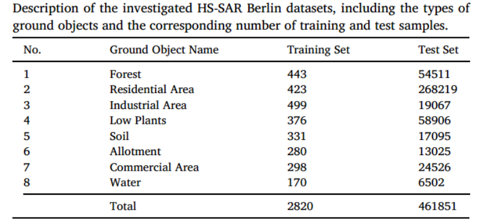
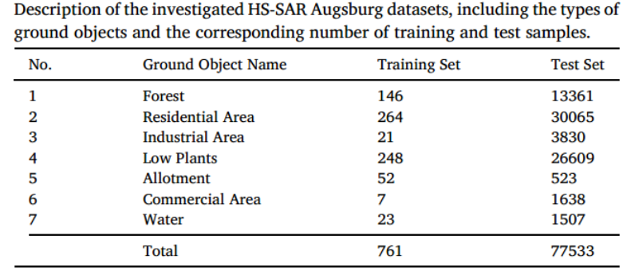

<!--more-->

### 总览

#### optical-dsm

|  数量  |    平均尺寸     | 空间分辨率 |               模态               |     数据集     |
| :----: | :-------------: | :--------: | :------------------------------: | :------------: |
|   38   | 6 000×6 000像素 |    5cm     | RGB、DSM、IRRG、RGBIR、归一化DSM |    Potsdam     |
|   33   | 2 494×2 046像素 |    9cm     |            DSM、IRRG             |   Vaihingen    |
| 10800  |   512×512像素   |    1米     |          RGB、点云、DSM          | N3C-California |
| 400+50 |   256×256像素   |    10米    |          MS、SAR、SRTM           |     DKDFN      |

#### optical-sar

|  数量  |   平均尺寸    | 空间分辨率 |     模态      |   数据集    |
| :----: | :-----------: | :--------: | :-----------: | :---------: |
|  100   | 5556×3704像素 |    5米     |  RGBIR、SAR   | WHU-OPT-SAR |
|   \    |       \       | 光学3.24m  |   光学、SAR   |   DDHRNet   |
|        |  900×900像素  |   0.5米    |  RGBIR、SAR   |    MSAW     |
| 400+50 |  256×256像素  |    10米    | MS、SAR、SRTM |    DKDFN    |

#### optical-lidar

| 数量 | 平均尺寸  | 空间分辨率 |   模态    |    数据集     |
| :--: | :-------: | :--------: | :-------: | :-----------: |
|      | 325 × 220 |            | HS、LiDAR | MUUFLGulfport |

#### hs-ms

| 数量 | 平均尺寸 | 空间分辨率 | 模态 | 数据集 |
| :--: | :------: | :--------: | :--: | :----: |
|      |          |            |      |        |

### Potsdam数据集

[2D Semantic Labeling Contest - Potsdam (isprs.org)](https://www.isprs.org/education/benchmarks/UrbanSemLab/2d-sem-label-potsdam.aspx)

示例：

| 数量 |      尺寸       | 空间分辨率 |               模态               |            备注            |
| :--: | :-------------: | :--------: | :------------------------------: | :------------------------: |
|  38  | 6 000×6 000像素 |    5cm     | RGB、DSM、IRRG、RGBIR。归一化DSM | 7_10号图像存在较多错误标注 |

### Vaihingen数据集

[2D Semantic Label. - Vaihingen (isprs.org)](https://www.isprs.org/education/benchmarks/UrbanSemLab/2d-sem-label-vaihingen.aspx)

示例：

| 数量 |    平均尺寸     | 空间分辨率 |   模态    | 备注 |
| :--: | :-------------: | :--------: | :-------: | :--: |
|  33  | 2 494×2 046像素 |    9cm     | DSM、IRRG |      |

### WHU-OPT-SAR数据集

[WHU-OPT-SAR-dataset](https://github.com/AmberHen/WHU-OPT-SAR-dataset)

| 数量 |   平均尺寸    | 空间分辨率 |    模态    |              备注              |
| :--: | :-----------: | :--------: | :--------: | :----------------------------: |
| 100  | 5556×3704像素 |    5米     | RGBIR、SAR | 该数据集由GF1和GF3采集自湖北省 |

### DDHRNet数据集

https://github.com/XD-MG/DDHRNet

| 数量 | 裁剪尺寸 | 空间分辨率 |   模态    |              备注              |
| :--: | :------: | :--------: | :-------: | :----------------------------: |
|  \   |    \     | 光学3.24m  | 光学、SAR | 来自GF2、GF3，西安、东营、浦项 |

### N3C-California

[IKDNet-pytorch](https://github.com/wymqqq/IKDNet-pytorch)

包含航空、点云和DSM图像，是一个专门为光学-点云多模态学习提出的数据集

| 数量  |  裁剪尺寸   | 空间分辨率 |      模态      | 备注 |
| :---: | :---------: | :--------: | :------------: | :--: |
| 10800 | 512×512像素 |    1米     | RGB、点云、DSM |      |

### ~~HS-MS Houston2013数据集~~

https://github.com/danfenghong/ISPRS_S2FL

### ~~HS-SAR Berlin数据集~~

https://github.com/danfenghong/ISPRS_S2FL

### ~~HS-SAR-DSM Berlin数据集~~

https://github.com/danfenghong/ISPRS_S2FL

### ~~MUUFLGulfport~~

[GatorSense/MUUFLGulfport: MUUFL Gulfport Hyperspectral and LIDAR Data: This data set includes HSI and LIDAR data, Scoring Code, Photographs of Scene, Description of Data (github.com)](https://github.com/GatorSense/MUUFLGulfport)

### MSAW 数据集

[Multi-Sensor All-Weather Mapping (spacenet.ai)](https://spacenet.ai/sn6-challenge/)

[SpaceNet遥感数据集下载及数据集说明_数据集spacenet下载-CSDN博客](https://blog.csdn.net/qq_23589775/article/details/83508429)

| 数量 |  裁剪尺寸   | 空间分辨率 |    模态    | 备注 |
| :--: | :---------: | :--------: | :--------: | :--: |
|      | 900×900像素 |   0.5米    | RGBIR、SAR |      |

只包含建筑物

### DKDFN

[HunanMultimodalDataset](https://github.com/LauraChow/HunanMultimodalDataset)

|  数量  |  裁剪尺寸   | 空间分辨率 |     模态      | 备注  |
| :----: | :---------: | :--------: | :-----------: | :---: |
| 400+50 | 256×256像素 |    10米    | MS、SAR、SRTM | 8:1:1 |

所有数据都被上采样为10m

